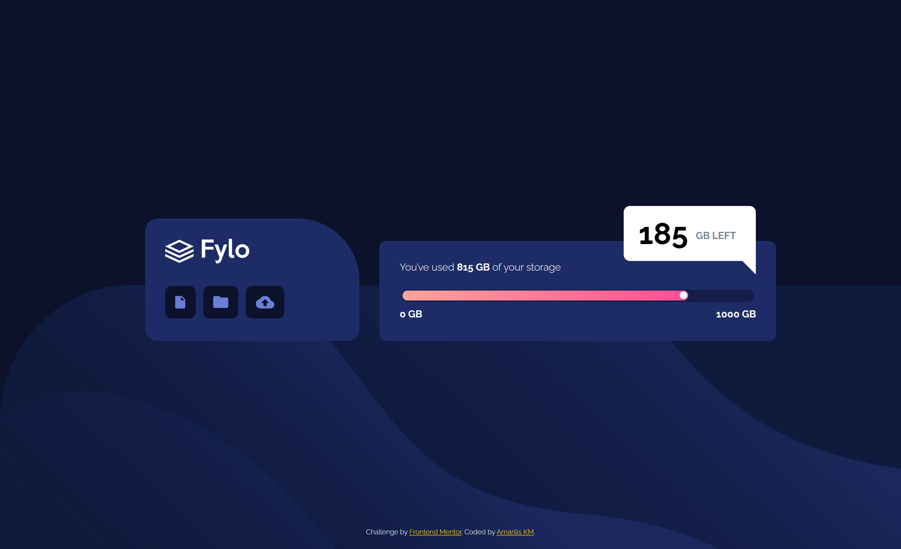
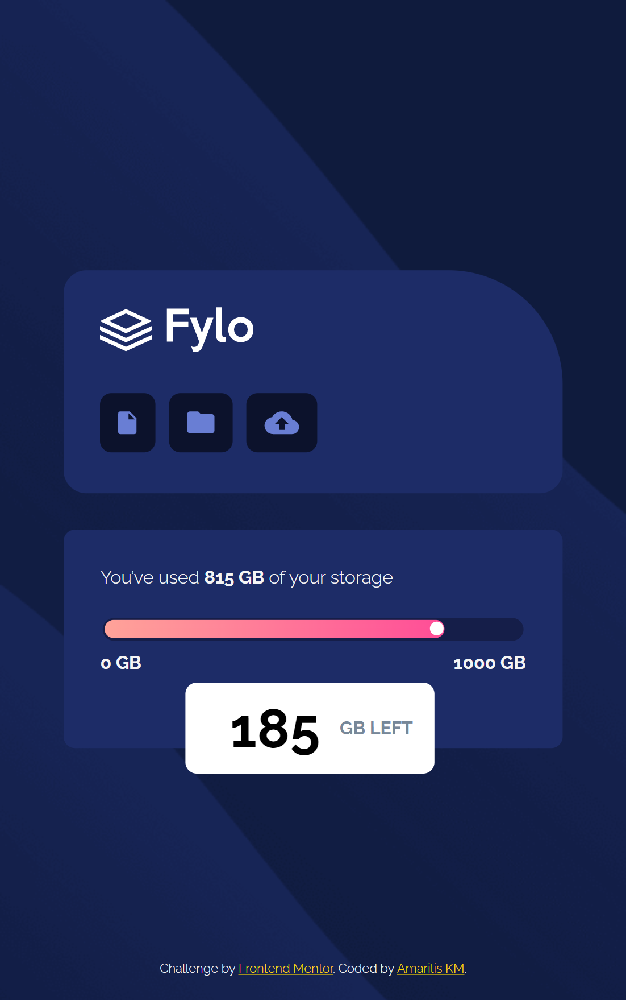

# Frontend Mentor - Fylo data storage component solution

This is a solution to the [Fylo data storage component challenge on Frontend Mentor](https://www.frontendmentor.io/challenges/fylo-data-storage-component-1dZPRbV5n). Frontend Mentor challenges help you improve your coding skills by building realistic projects. 

## Table of contents

- [Overview](#overview)
  - [The challenge](#the-challenge)
  - [Screenshot](#screenshot)
  - [Links](#links)
- [My process](#my-process)
  - [Built with](#built-with)
  - [What I learned](#what-i-learned)
  - [Useful resources](#useful-resources)
- [Author](#author)

## Overview

### The challenge

Users should be able to:

- View the optimal layout for the site depending on their device's screen size

### Screenshot

### Links

- Solution URL: [Github Repo](https://your-solution-url.com)
- Live Site URL: [live site URL](https://your-live-site-url.com)

## My process

### Built with

- Semantic HTML5 markup
- CSS custom properties
- Flexbox
- CSS Grid
- Mobile-first workflow

### What I learned

1. i learned abaout meter in html, at first i thought it was input slider range. but its weird to use slider for leftover GB with range that can slide.
2. i learn to make chat shape with content =""; and set to unset when in phone screen to remove it in css.
3. and i just found out that we must selecting the weight font that we want in google font before apply it.

### Useful resources

- [W3School](https://www.w3schools.com/) - This helped me for learn meter in html.
- [stackoverflow](https://stackoverflow.com/questions/33419754/single-line-shorthand-background-style) - This question helped me to learn make background style in one line.

## Author

- Github - [Github](https://github.com/amariliskm)
- Frontend Mentor - [@amariliskm](https://www.frontendmentor.io/profile/amariliskm)

